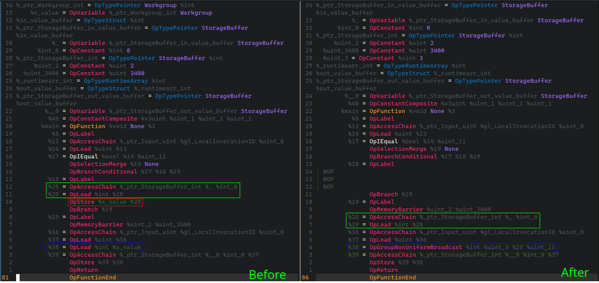
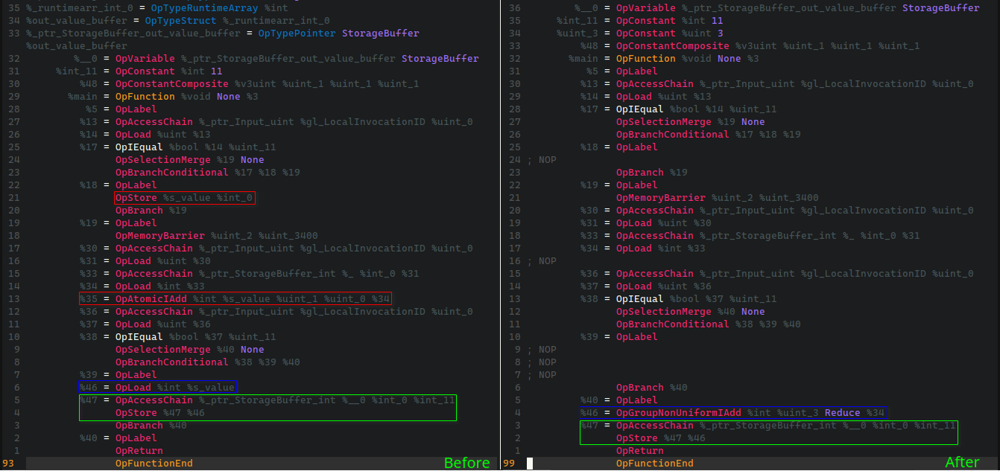
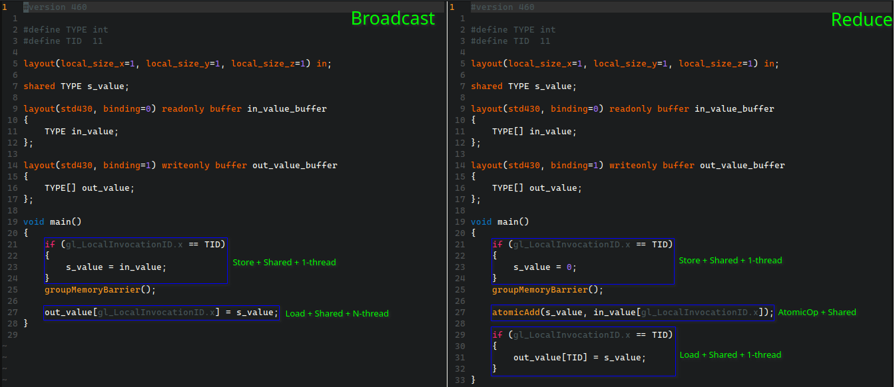

# GPU shader optimization via automatic SPIRV subgroup transformations

### Broadcast


SPIRV assembly transformations with color highlights.
Red: deleted, green: moved, and blue: replaced.


Generated GLSL code produced by the SPIRV cross-compiler.

### Reduce


SPIRV assembly transformations with color highlights.
Red: deleted, green: moved, and blue: moved + replaced.


Generated GLSL code produced by the SPIRV cross-compiler.

### Auto-detection Illustration


Illustration of auto-detection tests applied to broadcast and reduce GLSL.
Note that auto-detection is actually performed on SPIRV assembly.

## Requirements

- [glslc](https://github.com/google/shaderc)
- [SPIRV-Tools](https://github.com/KhronosGroup/SPIRV-Tools)
- [SPIRV-Cross](https://github.com/KhronosGroup/SPIRV-Cross)
- [Python 3.10+](https://www.python.org/)

## Usage

```
$ python run.py filename [--validate | --no-validate] [--optimize | --no-optimize] [--show | --no-show] [--verbose | --no-verbose]
```

### Options

- `--validate`: Validate transformed SPIRV assembly (Default: false)
- `--optimize`: Optimize transformed SPIRV assembly (Default: true)
- `--show`:     Display cross-compiled GLSL code    (Default: true)
- `--verbose`:  Display additional debug logs       (Default: false)

### Examples

#### Show cross-compiled GLSL source

```
$ python run.py tests/broadcast/before.comp --show
$ python run.py tests/reduce/before.comp --show
```

#### Perform validation checks

```
$ python run.py tests/broadcast/before.comp --validate
$ python run.py tests/reduce/before.comp --validate
```

